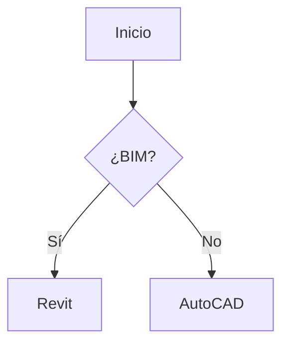

# Formato de Lecciones Markdown (.md)

## Formato Soportado

OpenCourse renderiza archivos Markdown usando `marked` + `marked-terminal`.
Se soporta **GitHub Flavored Markdown** completo.

## Elementos Soportados

### Headings
```markdown
# Título Principal
## Subtítulo
### Sección
#### Sub-sección
```

### Texto
```markdown
Texto normal, **negrita**, *cursiva*, ~~tachado~~, `código inline`.
```

### Listas
```markdown
- Item 1
- Item 2
  - Sub-item
  
1. Primero
2. Segundo
3. Tercero
```

### Tablas
```markdown
| Columna 1 | Columna 2 | Columna 3 |
|-----------|-----------|-----------|
| Dato A    | Dato B    | Dato C    |
| Dato D    | Dato E    | Dato F    |
```

### Bloques de Código
````markdown
```python
def hello():
    print("Hello, World!")
```

```javascript
console.log("OpenCourse");
```
````

### Citas
```markdown
> Esto es una cita importante.
> Puede tener múltiples líneas.
```

### Links
```markdown
[Texto del link](https://ejemplo.com)
```

### Separadores
```markdown
---
***
```

### Checkboxes (listas de tareas)
```markdown
- [x] Tarea completada
- [ ] Tarea pendiente
```

## Atajos en el Visor

| Tecla | Acción                        |
|-------|-------------------------------|
| ↑↓    | Scroll arriba/abajo           |
| PgUp  | Scroll 10 líneas arriba       |
| PgDn  | Scroll 10 líneas abajo        |
| e     | Abrir en editor externo       |
| d     | Abrir diagrama Mermaid (si hay)|
| m     | Marcar como completado        |
| ←/Esc | Volver                        |

## Diagramas Mermaid

Si el markdown contiene un bloque de código con lenguaje `mermaid`,
la tecla `d` abrirá [Mermaid Live Editor](https://mermaid.live) en el navegador.

````markdown

````
